# Distributed Job Scheduler - Diagrams

This document contains various diagrams that visualize the system architecture, flows, and interactions.

## 1. Architecture Overview

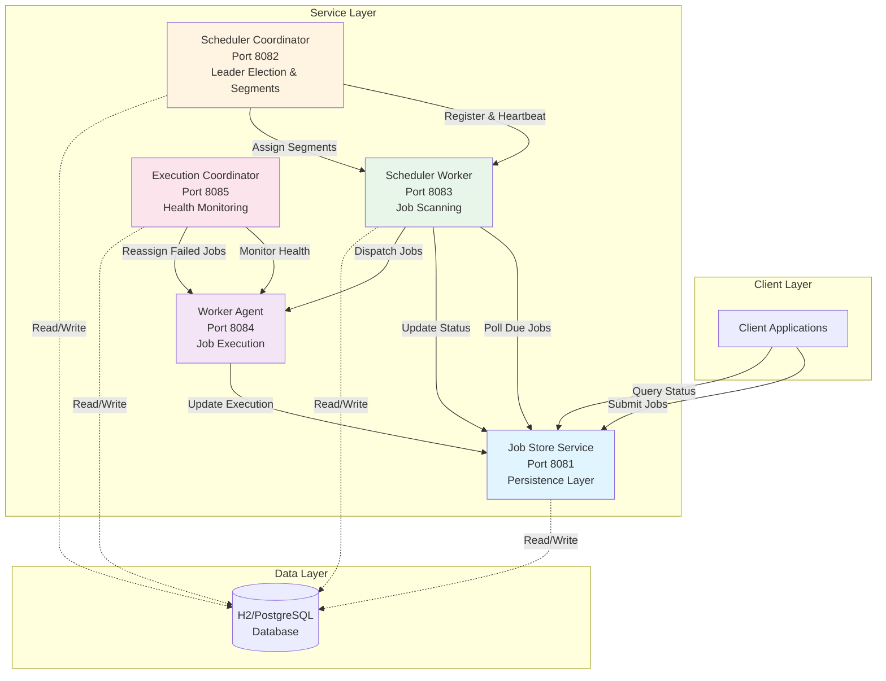

## 2. Job Submission Flow

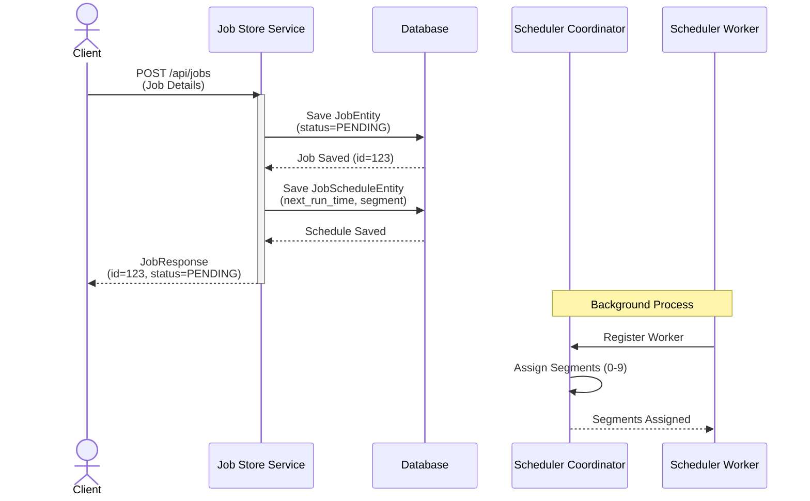

## 3. Job Scheduling and Execution Flow

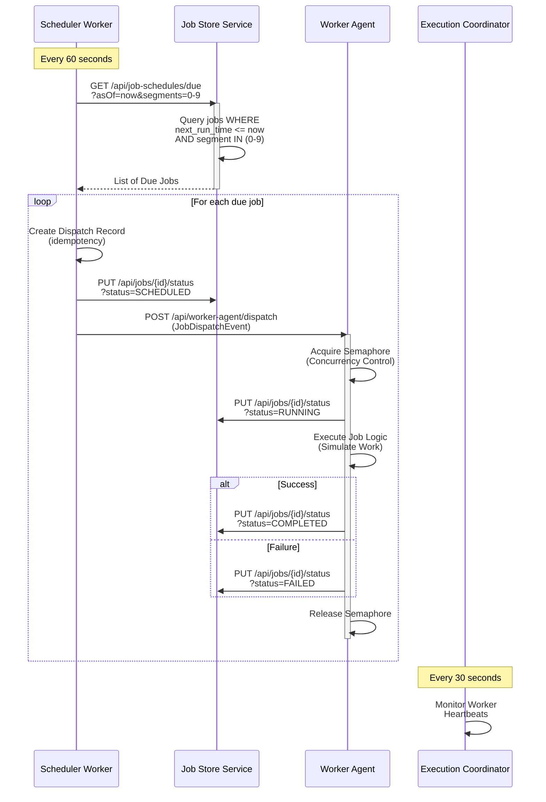

## 4. Component Dependencies

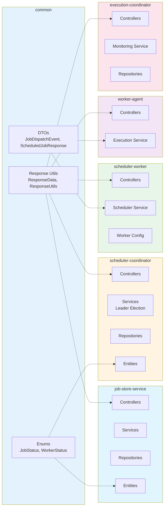

## 5. Segment-Based Partitioning

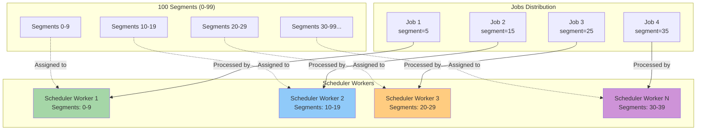

## 6. Leader Election Process

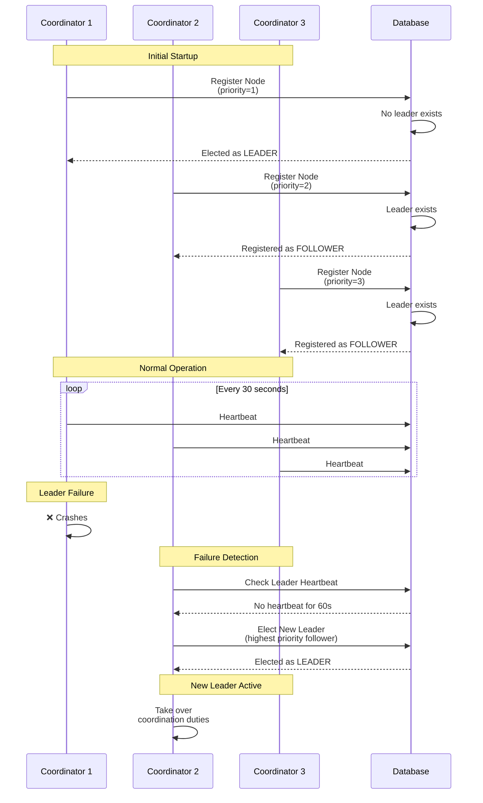

## 7. Worker Health Monitoring

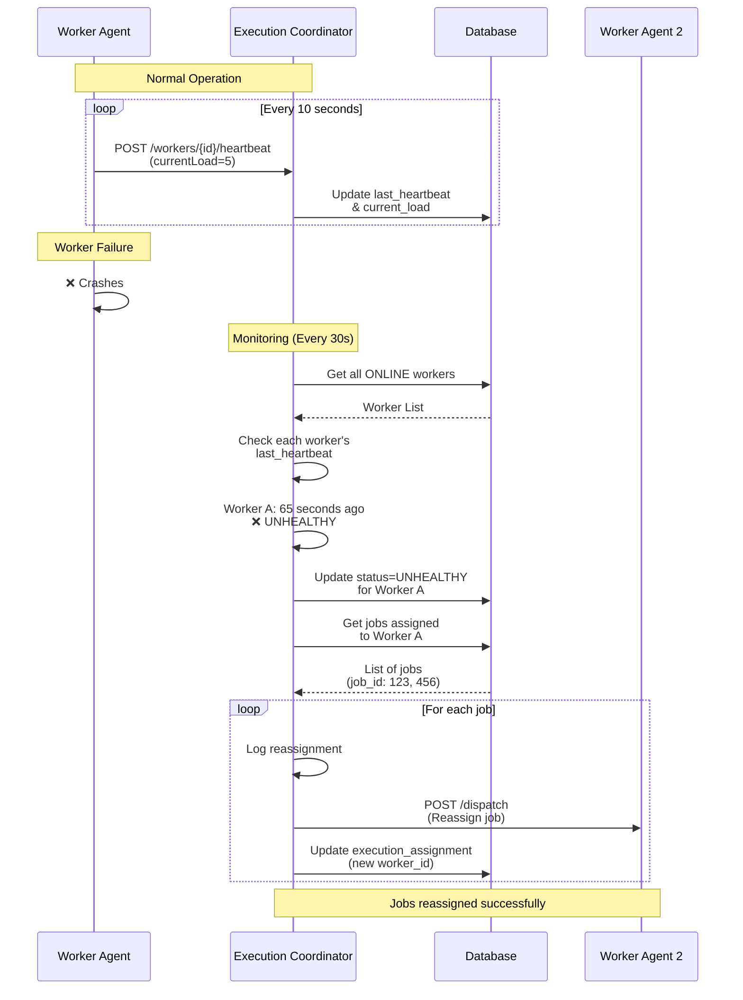

## 8. Database Schema Relationships

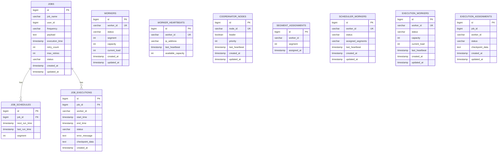

## 9. Concurrency Control Flow

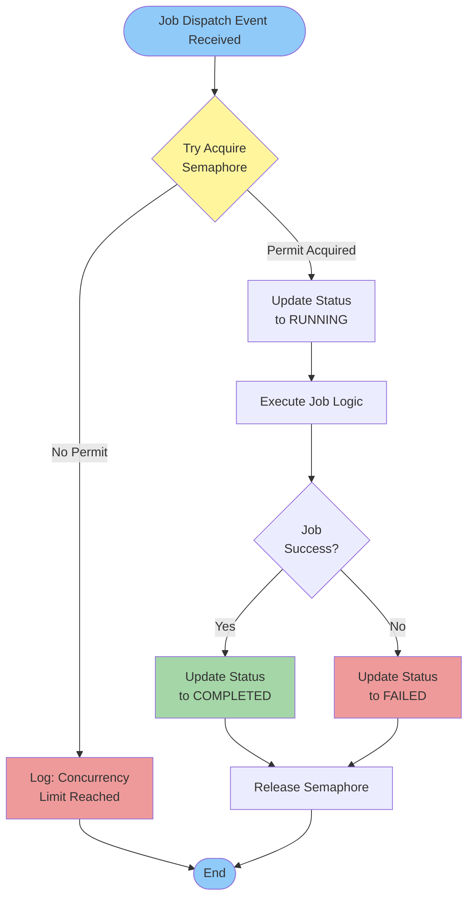

## 10. Idempotency Pattern

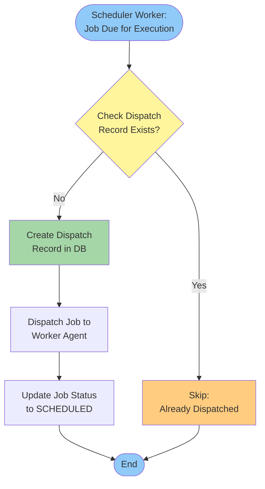

## 11. Failure and Retry Flow

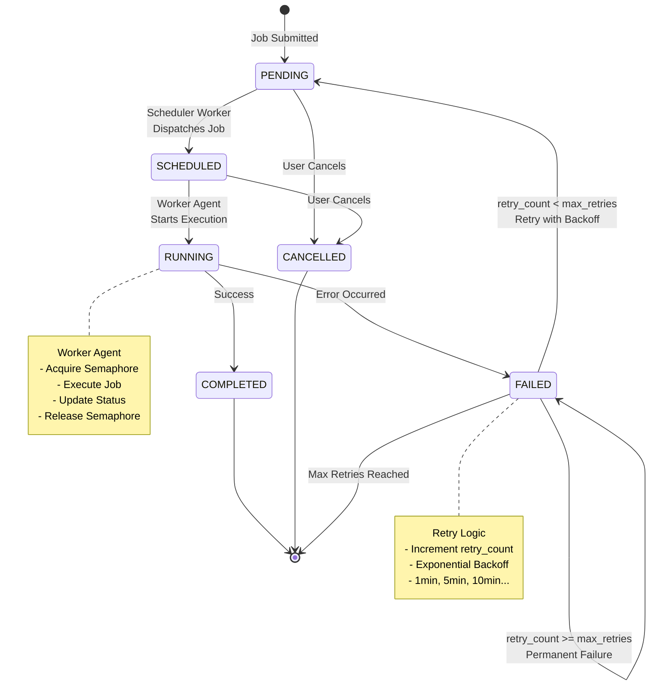

## 12. Horizontal Scaling Strategy

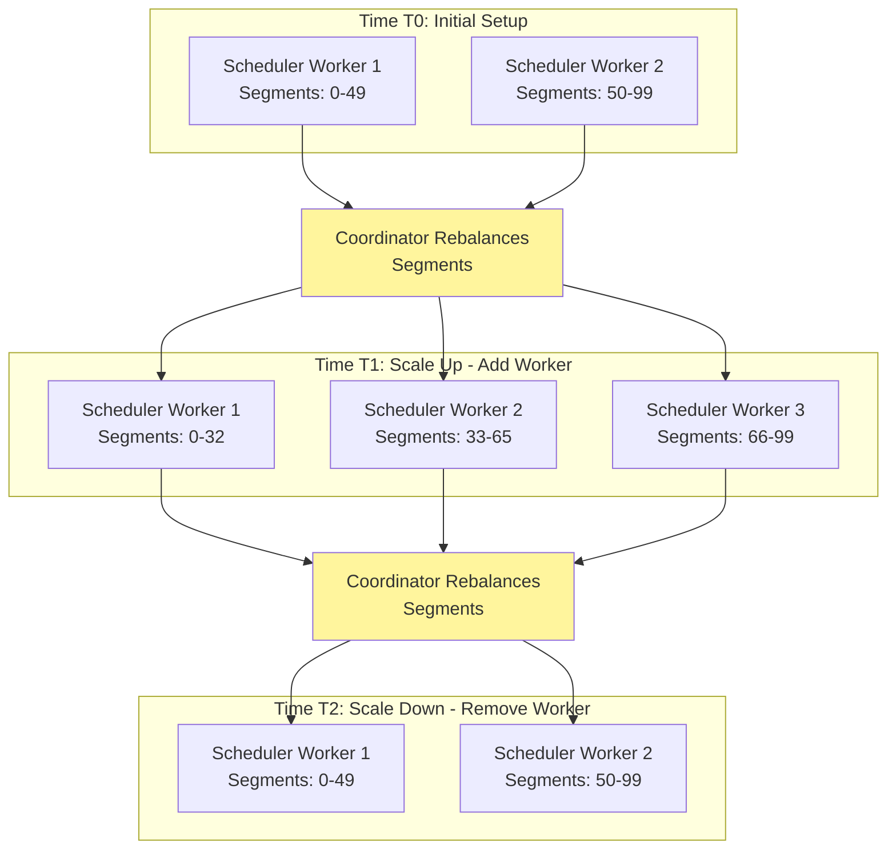

## How to View These Diagrams

These diagrams use Mermaid syntax and can be viewed in:
- **GitHub**: Automatically renders Mermaid diagrams
- **VS Code**: Use the Mermaid Preview extension
- **Online**: [Mermaid Live Editor](https://mermaid.live/)
- **IntelliJ IDEA**: Use Mermaid plugin

## Diagram Legend

- **Blue**: Core services and components
- **Yellow**: Decision points and coordinators
- **Green**: Success paths and active states
- **Red**: Error paths and failures
- **Purple**: Worker execution components
- **Orange**: Monitoring and observability
